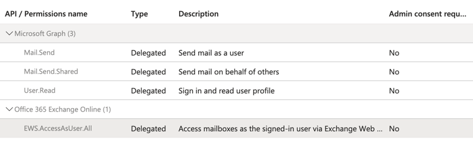

## Sending emails from a delegated mailbox with Office 365

The process of setting up access to Exchange Web Services (EWS) via OAuth with
Office 365 to enable sending emails from a delegated mailbox is described below.
If the application already exists, you can skip to the
[next section](#user-sign-in-and-consent).

Access to the delegated mailbox should first be given to any user intending to
follow this process.

An Azure Active Directory App registration must be made in order to email from a
delegated mailbox. When setting up the project from scratch (with no existing
app registration), we have followed the
[Impersonation OAuth on Office 365 instructions](https://ecederstrand.github.io/exchangelib/#oauth-on-office-365)
provided by the [exchangelib docs](https://ecederstrand.github.io/exchangelib/)
in full.

In brief, new app registrations should be made by:

- Authenticating with your institutional login on
  [https://portal.azure.com](https://portal.azure.com)
- Searching for 'App Registrations'
- Creating a new registration and noting down the tenant ID and
  client/application ID
- Creating a client secret with a sensible name and noting down the secret value
  (e.g. `client secret`)
- Setting API permissions as described in the exchangelib docs. Instead of
  `full_access_as_app` add the following permissions: `EWS.AccessAsUser.All`
  (found under) `Office 365 Exchange Online` and `Mail.Send`, `Mail.Send.Shared`
  and `User.Read` from `Microsoft Graph`. Selecting "Delegated" permissions in
  the previous step enables the app registration to authenticate via user
  sign-in. 
- Under `Authentication`, set a redirect URI for "Mobile and desktop
  applications". The default
  `https://login.microsoftonline.com/common/oauth2/nativeclient` will work.
- Also under `Authentication`, ensure "Accounts in this organizational directory
  only" is selected under "Supported Account types" **and** ensure that "Allow
  public client flows" is set to "Yes".

### User sign in and consent

As a user, you must consent to the registered application service by visiting a
URL with the pattern

`https://login.microsoftonline.com/{tenant_id}/oauth2/authorize?client_id={app_id}&redirect_uri=https://login.microsoftonline.com/common/oauth2/nativeclient&response_type=code&prompt=consent`

The `tenant_id` and `app_id` should be the ones noted at the App registration
stage, or documented internally.

Sign in and consent to the requested app permissions. The page will be blank
after you have done this, that's all good!

### Settings to enable email sending

Create a `secrets.toml` from the provided example

```bash
cp src/rred_reports/.example-secrets.toml src/rred_reports/.secrets.toml
```

Fill in `client_id`, `client_secret` and `tenant_id` with the values noted down
from the app registration, or documented internally.

For the study, we will want so `send_email_as` to be set to
`"ilc.comms@ucl.ac.uk"`

The `scope` would be `'https://outlook.office.com/.default'` and `server` =
`'outlook.office365.com'`

Fill in the `username` that will be used to authenticate the application.
`.secrets.toml` has been added to the `.gitignore`, but this file should
**never** be committed to version control.
